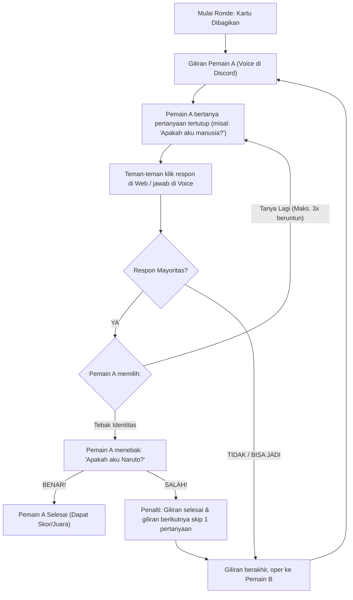
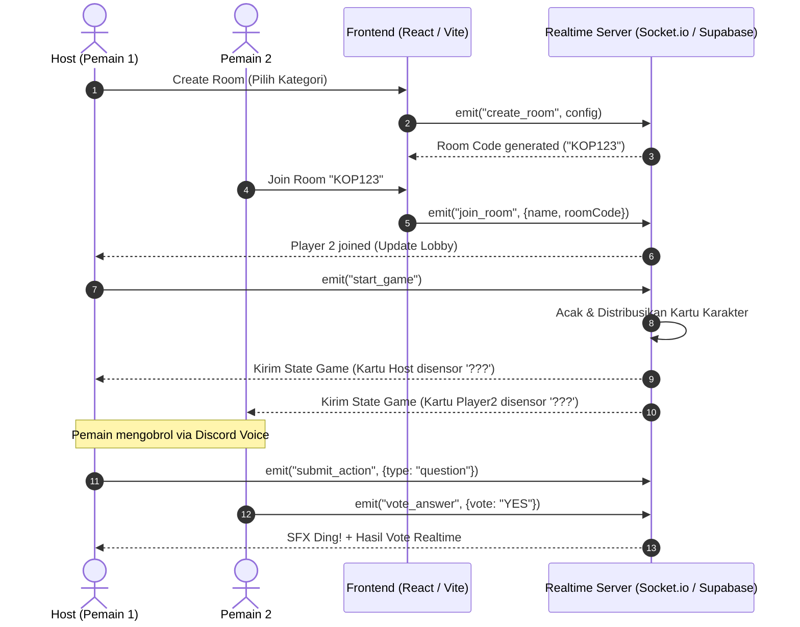

# 📋 Dokumen Rancangan & Aturan Main: "Siapa Gue?" (Tebak Karakter Online)

> **Working Title:** *Siapa Gue?* (Online Tongkrongan Edition)  
> **Target Platform:** Web (Desktop & Mobile Friendly) + Voice Call External (Discord / Google Meet / WA Call)  
> **Jumlah Pemain:** 3 – 10 orang

---

## 1. Konsep & Aturan Main (Game Rules)

### 1.1. Inti Permainan (Core Objective)
Setiap pemain mendapatkan satu kartu identitas/karakter rahasia. **Pemain dapat melihat kartu identitas semua teman di layar, tetapi kartunya sendiri tertutup (`???`).**  
Tujuan permainan adalah menjadi orang pertama yang berhasil menebak identitas dirinya sendiri dengan mengajukan serangkaian pertanyaan tertutup melalui voice chat.

---

### 1.2. Kategori Kartu (Decks)
Terdapat dua mode pemilihan kartu:
1. **Preset Deck (Katalog Bawaan):**
   * *Pop Culture Indo:* Artis, Musisi, Streamer/YouTuber, Selebgram.
   * *Meme & Tokoh Viral:* Karakter viral TikTok/Twitter, figur publik unik.
   * *Anime & Wibu:* Karakter anime populer.
   * *Benda Mati & Profesi:* Objek sehari-hari di tongkrongan (helm bogo, warkop, kang parkir).
2. **Custom Tongkrongan Deck (Mode Paling Seru):**
   * Sebelum ronde dimulai, masing-masing pemain mengetik 1–2 nama secara rahasia (bisa nama teman tongkrongan sendiri, dosen killer, gebetan, atau lelucon internal).
   * Sistem mengacak dan membagikan nama-nama tersebut sehingga tidak ada yang mendapat nama yang ia buat sendiri.

---

### 1.3. Struktur Ronde & Siklus Giliran (Turn Cycle)



#### Aturan Pertanyaan:
* Pertanyaan harus berupa **pertanyaan tertutup** (hanya bisa dijawab: `Ya`, `Tidak`, `Bisa Jadi / Ragu`, atau `Tidak Relevan`).
  * *Contoh valid:* "Apakah aku orang asli?", "Apakah aku masih hidup?", "Apakah aku berkacamata?"
  * *Contoh tidak valid:* "Kira-kira umurku berapa?"
* **Streak Keberuntungan:** Jika jawaban teman-teman adalah **"Ya"**, pemain tersebut berhak bertanya lagi (maksimal 3 kali berturut-turut) atau langsung mencoba menebak identitasnya.
* **Pergantian Giliran:** Jika jawaban adalah **"Tidak"** atau **"Bisa Jadi"**, giliran langsung berpindah ke pemain di sebelahnya searah jarum jam.

#### Aturan Tebakan Akhir:
* Pemain dapat menebak identitasnya kapan saja saat gilirannya tiba.
* Jika tebakannya **BENAR**, kartu pemain terbuka dan pemain tersebut dinobatkan sebagai pemenang (atau menunggu peringkat ke-2 dan ke-3).
* Jika tebakannya **SALAH**, pemain terkena penalti (gilirannya hangus untuk ronde itu dan oper ke pemain lain).

---

## 2. Fitur Pendukung Voice & Discord

> [!TIP]
> Game web ini dirancang sebagai **pendamping voice chat**. Web bertugas mengelola status game, visual kartu, timer, dan efek suara (SFX) agar obrolan di Discord semakin hidup.

1. **Reaksi Cepat Web (Web Buzzer & SFX):**
   * Ketika pemain yang sedang giliran bertanya di Discord, teman-teman yang lain tidak harus berisik berebut bicara; mereka cukup menekan tombol di web:
     * 🟢 **YA** (Play SFX: *Bell Ding!*)
     * 🔴 **TIDAK** (Play SFX: *Buzzer Tet-tot!*)
     * 🟡 **BISA JADI** (Play SFX: *Scratch/Huh?*)
   * Suara dapat terdengar di browser masing-masing pemain secara sinkron.
2. **Turn Indicator & Timer:**
   * Menampilkan nama dan avatar siapa yang sedang berbicara/bertanya.
   * Timer 45–60 detik per giliran agar game tetap dinamis dan tidak ada yang bengong kelamaan.
3. **Catatan Rahasia (Scratchpad Notes):**
   * Di layar masing-masing pemain, disediakan panel kecil untuk mencatat clue yang sudah terbukti benar (misal: *Bukan manusia, dari anime, berambut kuning*).

---

## 3. Rancangan Arsitektur Sistem (System Architecture)



---

### 3.1. Struktur Data (Data Schema)

#### Room State:
```json
{
  "roomCode": "NGOP1",
  "status": "PLAYING", // "LOBBY" | "PLAYING" | "GAME_OVER"
  "hostId": "usr_abc123",
  "settings": {
    "deckCategory": "pop_culture_indo",
    "turnTimeLimit": 60,
    "maxStreaks": 3,
    "customCardSubmissions": false
  },
  "currentTurnIndex": 0,
  "turnTimer": 45,
  "players": [
    {
      "id": "usr_abc123",
      "name": "Budi",
      "avatar": "avatar_1",
      "assignedCard": "Deddy Corbuzier",
      "isGuessed": false,
      "notes": ["Botak", "Suka podcast"],
      "streakCount": 1
    },
    {
      "id": "usr_xyz789",
      "name": "Agus",
      "avatar": "avatar_2",
      "assignedCard": "Naruto Uzumaki",
      "isGuessed": false,
      "notes": [],
      "streakCount": 0
    }
  ]
}
```

> [!IMPORTANT]
> **Data Masking (Anti-Cheat):**
> Server **TIDAK BOLEH** mengirim nilai `assignedCard` asli milik pemain ke client pemain itu sendiri melalui websocket. 
> Payload yang dikirim ke `usr_abc123`:
> - Kartu Budi: `null` atau `"???"`
> - Kartu Agus: `"Naruto Uzumaki"`  
> Ini mencegah pemain melihat kartu sendiri lewat inspect element/network tab.

---

### 3.2. Rekomendasi Tech Stack

| Layer | Pilihan Teknologi | Alasan |
|---|---|---|
| **Frontend** | React (Next.js atau Vite) + Tailwind CSS | Cepat, responsif untuk mobile dan PC, animasi kartu mulus. |
| **Icons & SFX** | Lucide React + Howler.js | Manajemen audio sound effect web yang ringan dan bebas delay. |
| **Realtime Engine** | **Socket.io (Node.js)** ATAU **Supabase Realtime** | *Socket.io* ideal untuk kontrol logika turn-based murni di server. *Supabase* ideal jika ingin *serverless* tanpa maintain VPS backend. |
| **Deployment** | Vercel (Frontend) + Railway/Render (Node.js Backend) | Gratis untuk kebutuhan hobi/tongkrongan. |

---

## 4. Rencana Tampilan Antarmuka (Wireframe Layout)

### Layar In-Game:
```
+--------------------------------------------------------------------------+
|  ROOM: [ NGOP1 ]                WAKTU: [ 00:38 ]             [ KELUAR ]  |
+--------------------------------------------------------------------------+
|                                                                          |
|   GILIRAN: 🎙️ BUDI SEDANG BERTANYA DI VOICE...                           |
|   "Apakah karakter gue sering bikin konten YouTube?"                     |
|                                                                          |
|   +--------------------------+        +--------------------------+       |
|   |         👤 BUDI          |        |         👤 AGUS          |       |
|   |   +------------------+   |        |   +------------------+   |       |
|   |   |                  |   |        |   |      NARUTO      |   |       |
|   |   |      [ ??? ]     |   |        |   |     UZUMAKI      |   |       |
|   |   |   (Kartu Kamu)   |   |        |   |                  |   |       |
|   |   +------------------+   |        |   +------------------+   |       |
|   |   Catatan: Manusia, Pria |        |   Status: Menyimak       |       |
|   +--------------------------+        +--------------------------+       |
|                                                                          |
|   +--------------------------+        +--------------------------+       |
|   |         👤 SITI          |        |         👤 REZA          |       |
|   |   +------------------+   |        |   +------------------+   |       |
|   |   |     LUNA MAYA    |   |        |   |    RADITYA DIKA  |   |       |
|   |   +------------------+   |        |   +------------------+   |       |
|   +--------------------------+        +--------------------------+       |
|                                                                          |
+--------------------------------------------------------------------------+
|  RESPON TEMAN UNTUK BUDI:                                                |
|  [ 🟢 YA (3) ]       [ 🔴 TIDAK (0) ]       [ 🟡 BISA JADI (1) ]         |
|                                                                          |
|  [ 💡 TEBAK KARAKTER GUE SEKARANG ]      [ ⏭️ AKHIRI GILIRAN ]           |
+--------------------------------------------------------------------------+
```

---

## 5. Roadmap Pengembangan (Implementation Steps)

1. **Fase 1: Minimum Viable Product (MVP)**
   * Sistem Room Code (Host membuat room, teman join via link).
   * Deck lokal statis (kumpulan 50+ karakter populer Indonesia).
   * Masking kartu (setiap pemain melihat kartu orang lain, kartunya tertutup).
   * Sistem giliran (turn cycle) dan tombol voting Ya/Tidak/Ragu + Sound effect.
2. **Fase 2: Custom Tongkrongan Deck**
   * Form input rahasia sebelum game mulai untuk memasukkan karakter buatan sendiri.
   * Modul acak kartu dengan validasi anti-dapat-kartu-sendiri.
3. **Fase 3: Integrasi Discord (Opsional tapi Keren)**
   * Menggunakan **Discord Embedded App SDK** agar game bisa langsung dimainkan di dalam Discord Voice Channel tanpa membuka browser terpisah.
